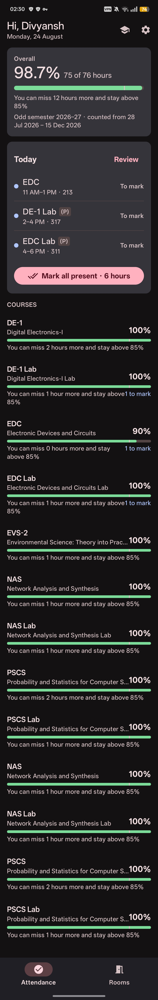
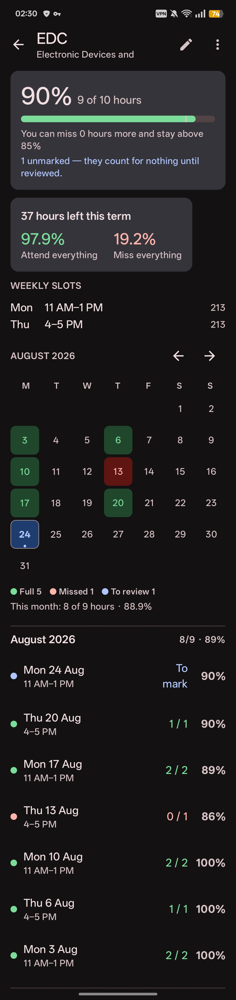
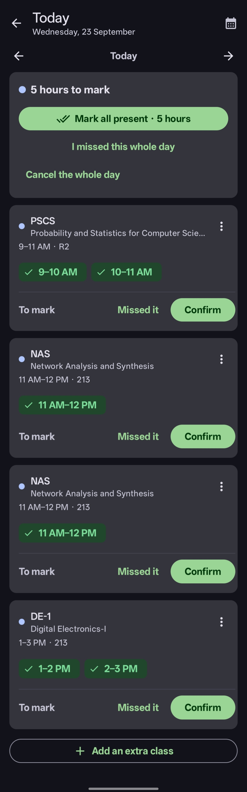
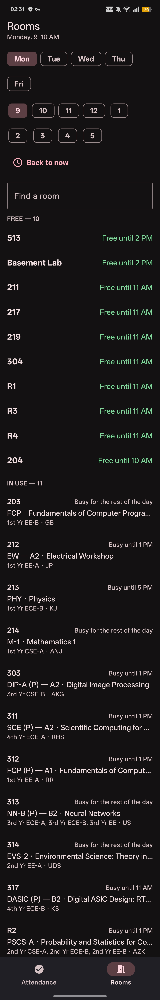
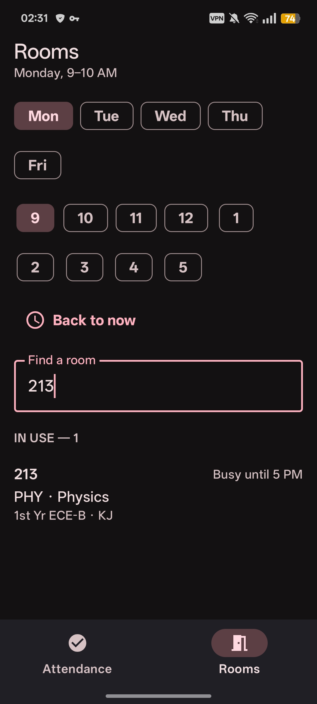
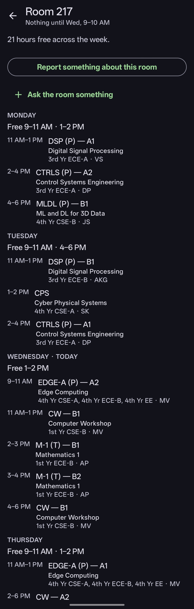
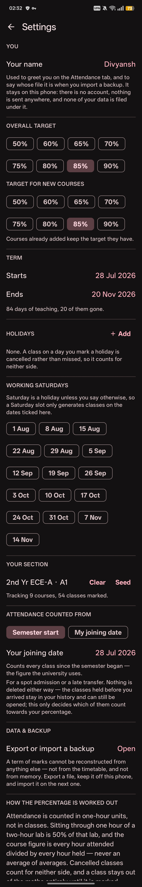
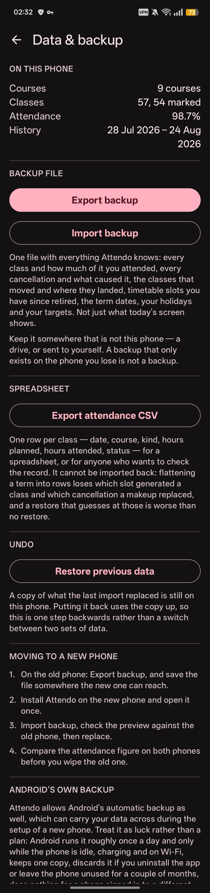

# Attendo

Attendance tracking and room lookup for students of the Faculty of Technology,
University of Delhi.

⭐ If you find Attendo useful, consider leaving a star on the repository — it helps the project and is greatly appreciated.

## What is Attendo?

Attendo is a free Android app that does two things a FoT student does every week:

- **Keeps your attendance** — for every class your timetable says you had, you record
  whether you were there. Attendance is counted in **hours**, so leaving a
  two-hour lab halfway through counts as exactly half of it, not as a coin-flip between
  present and absent. Each course gets its own percentage and a target, and the app tells
  you how many classes you can still afford to miss — or how many you must attend to get
  back to your target.
- **Finds rooms** — which rooms are free right now, and what any room's whole week looks
  like. The faculty's printed timetable ships inside the app.

Attendo uses anonymous, aggregate usage analytics to help understand whether and how
widely the app is used. Everything you record stays on your phone until you export it
yourself.

## What can it do?

- **A normal day in one tap.** Open the app, tap *Mark all present*, done.
- **Missed the whole day?** One action marks every class that day as missed — and it
  counts honestly, on both sides of the fraction.
- **Everything else about a class**: it was cancelled (and why), it ran short, it moved to
  another hour or another day, it was an extra class nobody timetabled, a note on anything
  unusual.
- **A backlog that tells the truth.** Classes from earlier dates that haven't been
  reviewed yet are shown clearly — you can review them day by day, mark the whole lot as
  missed, or cancel the whole lot. There is deliberately no way to just *ignore* them:
  unmarked hours are not a rounding problem.
- **A colour-coded calendar** of your semester, per course and overall.
- **Semester management**: semester dates, holidays, working Saturdays, a personal joining
  date if you arrived mid-semester.
- **Backup and restore** to a single file you control — see below.
- **A semester record PDF** and a **CSV spreadsheet** of your whole history, for showing
  anyone who asks.
- **Light or dark, or however the phone is set** — with Android 12's wallpaper colours
  when the device supports them.

## Installation

Attendo is not on any app store. Install the APK from
[GitHub Releases](https://github.com/divsysx/Attendo/releases):

1. Download the `.apk` file on your phone.
2. Open it. Android will ask for permission to install from that source (your browser or
   file manager) — allow it once.
3. Open Attendo. Android 8 (Oreo) or newer is required.

Updates arrive the same way. Attendo checks quietly in the background — at most once a
day — and when a newer release is published the update card appears on the app's main
screen. Settings → Updates can check sooner; a release you dismiss with *Not now* is not
offered again until a genuinely new one is published.

## Getting started

1. **Seed your courses.** On first open, tap *Seed from timetable*, pick your section and
   your lab batch, and tick the subjects you actually take. Attendo proposes courses from
   the faculty timetable, one course per subject — labs and tutorials are separate
   courses, because they are taught, examined and attended separately. Anything it cannot
   make sense of (two subjects at the same hour, a lab split across batches) is flagged
   for you rather than guessed at. You can also add courses by hand.
2. **Set your targets.** In Settings, pick an overall target and a target for new courses.
   75% is the usual university requirement.
3. **Mark today.** That's the whole daily routine. Open the app, and if you went to
   everything, tap *Mark all present*.

## Attendance

**Attendance is counted by the hour.** A two-hour class is worth two hours; attending one
of them is 50% of that class. A course's percentage is `hours attended ÷ hours held`, never
an
average of class percentages — so a two-hour lab weighs twice what a one-hour lecture
does. Your overall figure works the same way across all courses.

- **A class you marked** counts on both sides: attended hours on top, held hours below.
- **A cancelled class** counts on neither side. A class that never happened must not count
  against you.
- **An unmarked class** counts on neither side *yet*. It stays in your backlog until you
  deal with it.

The day screen shows each class as a strip of one-hour chips — tap the hours you attended
and confirm. Anything unusual about a class (cancelled, shortened, moved, extra) lives
behind the ⋮ menu on that class.

The dashboard warns you when past days still have unmarked classes: *"You have classes
from earlier dates that haven't been reviewed yet."* Review them one day at a time, or use
*I missed all of them* / the cancel action to deal with the whole backlog at once. These
actions only ever touch classes that are still unmarked — anything you already recorded
is left alone.

If you joined mid-semester, Settings → *Attendance counted from* lets you count from your
joining date instead of the semester start. Nothing is deleted either way; the earlier
classes stay in your history and this only decides which of them count towards your
percentage.

## Finding a room

The **Rooms** tab shows which rooms are free right now and which are in use, with what.
Search by room number, or tap a room to see its whole week — the timetable covers
9 AM to 6 PM, Monday to Saturday. Anything outside those hours is unbooked, which is not
the same as being open.

The timetable ships inside the app as a CSV, transcribed from the faculty's printed grid.
When the faculty prints a new one, the repository updates it and a new release carries it
in.

## Backup and restore

Your attendance records are the one thing that cannot be reconstructed — not from the
timetable, and not from memory. So there is an explicit export, and it is not the same
thing as Android's automatic backup (which Attendo ships switched off, and which you can
turn on if you want it — see *Moving to a new phone* below).

Everything here lives under **Settings → Data & backup**.

### Export a backup

1. Tap **Export backup**.
2. Android's file picker opens with a name filled in — `attendo-backup-2026-08-19.json`.
   Put it wherever you like: Drive, Downloads, a folder that syncs.
3. Move it off the phone. A backup that only exists on the phone you lose is not a backup.

The file holds everything the app knows: every course, every timetable slot (including
retired ones), every class with *which hours* you attended, every cancellation and its
reason, both halves of every moved class, semester dates, holidays, targets, your section
and your name.

### Import a backup

1. Tap **Import backup** and pick the file.
2. The whole file is checked before anything changes — JSON, format version, SHA-256
   checksum, every value and reference.
3. A preview shows what is in the file next to what is on the phone now.
4. **Replace** deletes the current data and writes the backup's. A copy of what was
   replaced is saved first, so **Restore previous data** can undo the import once.

An import either happens completely or not at all. A malformed, truncated, failed-checksum
or internally inconsistent file is refused and nothing is touched. Older format versions
are upgraded on the way in.

### Moving to a new phone

1. Old phone: **Export backup**, and save the file somewhere the new phone can reach.
2. Install Attendo on the new phone and open it once.
3. New phone: **Import backup**, check the preview, then **Replace**.
4. Compare the overall percentage on both phones before you wipe the old one.

Attendo can also take part in Android's own automatic backup, through the **Automatic
backup** switch on the same screen. It is off by default: while it is off, uninstalling
Attendo really removes the data, and reinstalling starts fresh. Turned on, Android *may*
copy your data to your Google account and put it back when you reinstall Attendo or set
up a new phone — whether it ever does is up to Android and the phone's backup settings
(it runs about once a day, while the phone is idle, charging and on Wi-Fi), and there is
no way to check from inside Attendo that a copy exists. Turning the switch off again
stops new copies, but cannot delete one Android has already stored. Treat it as luck
rather than a plan — the export is the copy you control.

### Starting fresh

**Settings → Data & backup → Clear all Attendo data** removes everything Attendo keeps
on this phone — your attendance records, your courses, your settings — and restarts the
app as a fresh install. It does not delete any backup Android or Google may already be
holding (nothing inside the app can), and it deliberately leaves two settings alone: the
Automatic backup switch and Appearance, which say how this phone behaves rather than
anything you recorded.

### The spreadsheet and the PDF

The same screen writes **Export attendance CSV** — one row per class, for Excel or for
anyone who wants to check the record. It cannot be imported back; flattening a semester
into rows loses information a restore would have to guess at.

At the end of a semester, Attendo offers to export a **semester record PDF** — per-course
figures and the full class history, the same numbers the app has been showing all
semester.

## Feedback

Found a bug, or have an idea? **Settings → Feedback → Report a bug or suggest an
improvement** opens your email app with the message started for you. Nothing is sent from
inside Attendo — there is no account and no server. You can also
[open an issue on GitHub](https://github.com/divsysx/Attendo/issues).

## Screenshots










## Contributors

- **Divyansh Sharma** — Project maintainer · [GitHub](https://github.com/divsysx)
- **Shubham Prasad** — Ideas, codebase improvements, suggestions, and testing · [GitHub](https://github.com/Shu6hamPrasad)
- **Adrija Roy** — Ideas, extensive testing, and suggestions · [GitHub](https://github.com/anshuroy11012007-hash)

---

## For developers

The sections above are for Attendo's users. The rest of this file is for anyone building
it or reading its code.

### Requirements

| | |
|---|---|
| JDK | 17 |
| Android SDK | API 35 (compile), minSdk 26 |
| Gradle | 8.11.1 — supplied by the wrapper, don't install it |
| Kotlin | 2.1.0 |

### Build and run

```bash
# Debug APK
./gradlew :app:assembleDebug

# Install on a connected device or running emulator
./gradlew :app:installDebug

# The calculation engine's tests — no Android SDK needed (see "Modules")
./gradlew :core:test

# Same thing, by intent rather than by path
./gradlew engineCheck

# The app's own JVM tests (backup ids, entity mapping) — SDK needed, device not
./gradlew :app:testDebugUnitTest
```

If `JAVA_HOME` points at anything other than 17:

```bash
JAVA_HOME=$(/usr/libexec/java_home -v 17) ./gradlew :core:test
```

The debug APK lands in `app/build/outputs/apk/debug/`.

### Release build

Release builds are signed with a keystore that is **not** in this repository. The
credentials come from `keystore.properties` at the repo root, which is untracked — as is
any `*.p12`, `*.jks` or `*.keystore` (see `.gitignore`) — so neither the passwords nor the
key itself can be committed by accident. Nothing secret appears in any Gradle script.

To produce a signed release, supply your own keystore and your own `keystore.properties`:

```properties
storeFile=path/to/your-release.p12
storePassword=<your store password>
keyAlias=<your key alias>
keyPassword=<your key password>
```

Point `storeFile` at a location outside the working tree. If the keystore is PKCS12,
`storePassword` and `keyPassword` have to be the same string — the format has no separate
key password.

```bash
./gradlew :app:assembleRelease   # lands in app/build/outputs/apk/release/
```

With any of those four keys missing, the release build fails during configuration rather
than quietly producing an unsigned APK. Debug builds are independent of all of it: they
keep using AGP's own generated debug keystore, so a fresh checkout with no
`keystore.properties` can still build, install and test debug.

On CI, write `keystore.properties` and the keystore file from your secret store before
invoking Gradle, and keep both out of the checkout and out of the build log.

### Publishing a release

The in-app updater reads GitHub Releases through the official API — nothing is scraped,
and there is no backend of our own. A release that the app can update from needs three
things, all of them parts of a normal GitHub Release:

1. **The version code in the release title.** Title the release `Attendo 1.2 (3)` — the
   parenthesised number is the Android `versionCode`, which is the only thing the updater
   compares ("1.10" versus "1.9" is not decidable from version names). A release whose
   title has no parenthesised number is skipped: there is no honest way to call it newer
   or older.
2. **The APK as a release asset**, any `.apk` name.
3. **A checksum asset next to it**, named exactly the APK's name plus `.sha256` — for
   `attendo-1.2.apk`, the asset `attendo-1.2.apk.sha256`:

   ```bash
   shasum -a 256 attendo-1.2.apk > attendo-1.2.apk.sha256
   ```

   One line, the `shasum` format; the app reads the first 64 hex digits. GitHub's release
   metadata cannot carry a checksum, which is why the checksum ships as an asset. A
   release without one still updates — the installer then relies on the package identity
   and signing-certificate checks alone — but every release should publish one.

Tag the release `v1.2` (the tag is where the version name comes from). Leave
**"Set as a pre-release"** unticked for stable releases: the updater asks the API for
`releases/latest`, which never returns drafts or pre-releases. That flag is also the
seam a future Beta/Early-Access channel would hang off — a pre-release is a beta by
another name, and a future beta provider would read the `releases` list and filter by it.

Before installing anything, the app checks that the downloaded file is newer than what is
installed, is actually Attendo (`com.attendo`), is signed by the release certificate, and
matches the published checksum. The certificate check compares against the public digest
in `ApkGate.RELEASE_SIGNER_SHA256` — the same fingerprint `apksigner verify --print-certs`
prints — never against anything private.

Checking is automatic and quiet. On every open the app raises the card for an update a
previous check found (a student offline since a release came out still hears about it),
and it asks GitHub at most once a day. A release dismissed with "Not now" is not offered
again until a genuinely different release is published, and the manual "Check" in Settings
is never throttled. A check that finds nothing, or cannot complete, says nothing — the
card appears on the app's main screen only when there is an update to act on.

### Modules

```
attendo/
├── core/     pure Kotlin/JVM — models, calculation engine, CSV import. No Android.
└── app/      Android — Room database, Compose UI.
```

`:core` holds everything where being wrong is expensive: the fractional-attendance
arithmetic, session generation from recurring patterns, and the room-availability
queries. It has no Android dependencies at all, so its tests run in a couple of seconds
on the JVM.

`:app` is **conditionally included** in `settings.gradle.kts` — only when an Android SDK
is actually present (`ANDROID_HOME`, `ANDROID_SDK_ROOT`, or `sdk.dir` in
`local.properties`). The Android Gradle Plugin fails during *configuration* without an
SDK, which would take `:core:test` down with it. This way you can check out the repo on
any machine with a JDK and run `./gradlew engineCheck`.

### How attendance is counted

Everything follows from one decision: **the unit is one hour**.

- A 2-hour class is worth 2 units. Attending one of them is 50% of that session.
- A course's percentage is `units attended ÷ units held`, not the mean of its session
  percentages — so a 2-hour lab weighs twice what a 1-hour lecture does.
- Your overall percentage is likewise `total units attended ÷ total units held` across
  all courses. Averaging the per-course percentages would let a 1-hour seminar cancel out
  a 4-hour workshop.

Percentages are stored as **basis points** (integers, 1 bp = 0.01%) and threshold
comparisons are cross-multiplied rather than divided. This is not fussiness: in floating
point, 60 units of 80 is not reliably ≥ 75%, and being told you have 74.99999% when you
have exactly three quarters is the one bug in this app nobody would forgive.

### Patterns, sessions, exceptions

Three things, deliberately kept separate:

| | |
|---|---|
| `SessionPattern` | A recurring weekly slot — *"ADEC, Monday 9 AM, 2 units, room 204"*. A template. Never a thing that happened. |
| `ClassSession` | One dated instance. Carries which units you attended, as a bitmask. |
| — | Exceptions are just sessions in a non-default state; there is no separate exception table. |

Sessions are generated from patterns, keyed by `(patternId, date)`. That key is what makes
generation idempotent — you can re-run it every time the app opens and never get
duplicates.

Three kinds of exception, and why each is shaped the way it is:

- **Cancelled** — status becomes `CANCELLED`, which drops the session out of *both* sides
  of the fraction. A class that never happened must not count against you.
- **Shortened** — `resize` lowers `unitsPlanned` and re-clamps the attended mask. Without
  the re-clamp, a fully-present 2-hour class shortened to 1 hour would report 2 units
  attended out of 1 planned: 200% attendance.
- **Rescheduled** — recorded as *two* rows: the original cancelled, plus an ad-hoc session
  on the new date, linked back to it. Mutating the original's date would vacate its
  `(patternId, date)` slot, and the next generation run would helpfully recreate the class
  you just moved.

Editing a pattern mid-semester works the same way: the old pattern is *retired*
(`effectiveTo` set to its last valid date) and a new one starts the next day, so sessions
already recorded keep pointing at the pattern that actually produced them. History stays
truthful.

The bulk actions work on the same primitives: "miss the whole day" and "I missed all of
them" are `markAbsent` applied to every still-pending row (HELD with an empty mask — the
hours count as held, so the denominator stays honest), and the bulk cancel is `cancel`
applied the same way. Rows already dealt with are never touched.

### Status, and what counts

| Status | In the denominator? |
|---|---|
| `SCHEDULED` | No — generated but not yet reviewed. Invisible to the maths. |
| `HELD` | Yes. |
| `CANCELLED` | No, on either side. |

### Updating the timetable each semester

The room timetable ships as a CSV in `app/src/main/assets/`, transcribed from the
faculty's printed grid.

```
day,start,units,room,subject,section,faculty,kind,batch
Mon,9,2,212,EW,1st Yr EE-A,JP,L,A2
Tue,14,1,203,ADEC,2nd Yr CSE-A,AP,L,
```

- `day` — `Mon`…`Sat`
- `start` — the slot's start hour, 24-hour clock: `9` is 9 AM, `14` is 2 PM. Valid 9–17.
- `units` — length in hours. **A 2-hour block is one row with `units=2`**, not two rows.
  (The printed grid splits blocks across two columns; if you transcribe it that way
  instead, `TimetableCsv.mergeAdjacent` will join them.)
- `room` — as printed. **Leave it empty when the grid prints no room** (SFL and anything else
  that meets on a field rather than in a hall). An empty room is a real class that occupies no
  room, not a bad line: it seeds like any other subject and never shows up in Rooms.
- `kind` — `L`, `P` or `T` (lecture, practical, tutorial). A tutorial can equally be written
  by tagging the subject `-T` (`ECA-T`); the seeder reads either.
- `batch` — for split labs (`A1`, `A2`, `B1`, `B2`); leave empty when the whole section
  attends.

Two companion files map the grid's acronyms to real names, same `code,name` shape:
`subjects.csv` and `faculty.csv`. Lookup tries the exact code first and then the part
before its last hyphen, so `NN-A` and `NN-B` both find `NN` while `DE-1` and `EM-I` keep
resolving to themselves. A code that's missing from either file costs you a long name, not
a blank screen.

**To update:** replace the three files, keeping the column order, then run:

```bash
./gradlew :core:test --tests '*BundledTimetableTest*'
```

That parses the file you just wrote and fails with the offending line number on anything
off the hour grid, any bad `kind` code, any truncated row — and, more usefully, on any
subject or faculty acronym you used but didn't add to the key.

#### Two things about the source data

**A class attended by several cohorts is printed on each cohort's page**, so it arrives as
several identical rows differing only by `section`. That's not a double-booking. Rows are
transcribed faithfully, one per page, and folded together for display by
`RoomAvailability.groupBookings` — which matches on everything *except* section, and so
shows one line naming all the cohorts. Genuine clashes (different subjects, same room and
hour) survive grouping and stay visible.

**Cells printed without a room** — SFL (Sports for Life / Fit India) is the one on this
timetable — are transcribed with the `room` column left **empty**. They are real classes: a
section that has SFL on Thursday afternoon has it whether or not the printed grid names a
hall for it, and the seeder proposes it like any other subject. What they are not is room
bookings, so they never appear in the Rooms tab, and they cannot clash with anything —
`RoomBooking.room` is nullable and `occupiesARoom` is what Room Availability filters on.
Leave the column empty rather than inventing a room or dropping the row: inventing one puts
a phantom booking on a real hall, and dropping it loses a course the student actually takes.

### Setting up your own courses

Either type them in by hand, or seed them from the timetable: pick your section, pick your
lab batch, and `SectionSeeder` proposes the courses that section is timetabled for, each
with a pattern per weekly slot. It only ever *proposes* — tick what you actually take, and
any hour where your section is booked into two subjects at once comes back in
`SeedPlan.clashes` for you to resolve.

Three things the seeder does with the printed page, because reading it literally gets them
wrong:

**A subject's practicals and tutorials each become their own course.** `ECA`, `ECA Lab`
and `ECA Tutorial` are separate rows, with separate targets and separate percentages,
because they're taught, examined and attended separately — a semester of missed labs
shouldn't disappear into a healthy lecture figure. A row is a lab when its `kind` is `P`,
and a
tutorial when its `kind` is `T` or its subject is tagged `-T`.

**A trailing `-A`/`-B` on a subject is dropped, and so is `-T`.** `-A`/`-B` names the
lecture group a pooled course is split into (`PSCS-A` and `PSCS-B` are one subject in two
halls) and a section sits in exactly one, so within one page it says nothing. Keep it and a
student whose lectures read `PSCS-B` and whose lab reads `PSCS` gets two unrelated courses
for one subject. `-T` leaves the code too, but unlike a group tag it isn't noise: it's what
marks the row a tutorial, and it wins over a `kind` column that says `L`. Only those three
suffixes go — `DE-1`, `EVS-2`, `EM-I` and `AEW-I` are whole codes.

**Only the section's own batch numbering is offered.** 2nd Yr ECE-A splits its branch labs
`A1`/`A2` — that's the choice — but its statistics lab is batch `B3`, pooled with 2nd Yr
EE-A. `B3` isn't a question that section answers, and a plain batch filter would delete
that lab the moment `A1` was picked. So a subject batched outside the offered scheme is
kept whichever batch you choose, and one still split two ways after your answer is flagged
`needsBatchCheck` for you to look at rather than guessed at.

### Your name

**Settings → You → Your name** is one text field, and everything it changes is cosmetic: the
Attendance tab greets you with your chosen name rather than a generic greeting, and a backup
you export after setting it uses that name instead of the default **Attendo** attribution.
Leave it empty and both fall back — no name is a normal state, not an unfinished setup step.

There is no account behind it and nothing to sign in to. Nothing is sent anywhere, no table is
keyed by it, and no row references it; it is a label, stored in `SharedPreferences` beside the
targets and the term dates. It travels inside a backup for one reason: so that restoring on a
new phone greets the same person, and so the import preview can say whose file you are looking
at.

### The backup file format

Written by hand in `core/backup/BackupWire.kt`, versioned, and deliberately independent of
both Room's schema and the domain classes — so a Room migration or a new field on
`ClassSession` cannot stop last semester's file from loading:

```json
{
  "formatVersion": 1,
  "app":        { "name": "Attendo", "versionName": "1.1", "versionCode": 2 },
  "exportedAt": "2026-08-19T09:30:00Z",
  "checksum":   { "algorithm": "SHA-256", "value": "<64 hex chars>" },
  "payload":    { "preferences": {}, "calendar": {}, "courses": [], "patterns": [], "sessions": [] }
}
```

- **Refs, not ids.** Every record carries a `"ref": "s1"` and points at others by ref. Primary
  keys belong to the database that issued them and all change on restore; a reschedule is two
  rows linked to each other, so an id-based format would have to renumber those links and hope.
- **Attendance as a list of hours.** `"attendedUnits": [0, 1]` rather than the bitmask `3`, so
  it stays readable and does not depend on `UnitMask`'s internals.
- **Enums, dates and instants as strings**, parsed defensively rather than by the serialiser,
  so an unrecognised value is reported against a field path instead of throwing out of a decoder.
- **The checksum covers the payload as written**, and is verified before any migration touches it.
- **Version migration**: `BackupMigrations` holds a chain of forward transforms from
  `OLDEST_SUPPORTED` to `CURRENT`, and a test asserts every step in that range exists. To
  change the format: bump `CURRENT`, add the transform, add a test that reads a file written in
  the old shape.

One dangling reference is legal, and it is the subtle one: a session's `patternRef` may name a
pattern that isn't in `patterns`. Deleting a slot keeps the classes already marked against it,
so a marked session can outlive its template — and it has to stay a *timetabled* class,
because origin is derived from whether a pattern id is present, and an empty `(pattern, date)`
slot is one the generator will fill in again. The importer gives such a reference an id of its
own. Every other reference must resolve.

Every way a backup can be refused reads the same on screen — *"That file isn't a valid Attendo
backup. Choose an Attendo backup (.json) file and try again."* — because they all have the same
remedy, and because a parser offset is not something anyone can act on. The specific reason is
not lost: it goes to logcat under the tag `AttendoBackup` (`adb logcat -s AttendoBackup`). See
`BackupMessages`.

### Layout

```
core/src/main/kotlin/com/attendo/core/
├── model/
│   ├── Percent.kt          basis-point percentage, exact integer arithmetic
│   ├── UnitMask.kt         which hours of a session you attended, as bits
│   ├── TimeGrid.kt         the 9-to-6 hourly slot grid and its labels
│   ├── Course.kt           courses and SessionKind (L/P/T)
│   ├── SessionPattern.kt   recurring weekly slots, with effective dates
│   ├── ClassSession.kt     one dated instance and its status
│   ├── RoomBooking.kt      one row of the room timetable
│   └── AcademicCalendar.kt term dates and holidays
├── engine/
│   ├── AttendanceEngine.kt per-session, per-course and overall percentages; target advice
│   ├── SessionGenerator.kt patterns + dates -> sessions; the daily review's DayPlan
│   ├── SessionOps.kt       mark, approve, cancel, resize, reschedule, ad-hoc, bulk
│   ├── CourseHistory.kt    one course's sessions, newest first, grouped by month
│   ├── CalendarBuilder.kt  the colour-coded month grid
│   └── RoomAvailability.kt free rooms now, a room's week, the day+time grid
├── rollover/
│   └── SemesterRecordRenderer.kt  the semester record PDF's contents, as pure data
├── backup/
│   ├── BackupSnapshot.kt   the whole logical state, as one value; normalised(), summarise()
│   ├── BackupWire.kt       the on-disk JSON schema, written by hand and versioned
│   ├── BackupCodec.kt      encode; decode with checksum, migration and full validation
│   ├── BackupChecksum.kt   SHA-256 over the canonicalised payload
│   ├── BackupMigrations.kt the chain of forward transforms between format versions
│   ├── BackupProblem.kt    every way a backup can be refused, with a field path
│   ├── BackupMessages.kt   the one sentence a refused file gets, and why it is one
│   └── AttendanceCsv.kt    the human-readable export — one row per class, not importable
└── data/
    ├── TimetableCsv.kt     CSV import/export, block merging, problem reporting
    ├── Glossary.kt         acronym -> full name
    └── SectionSeeder.kt    a section's page -> proposed courses and patterns
```

```
app/src/main/kotlin/com/attendo/
├── AttendoApplication.kt        the AppContainer — database, repositories, settings
├── MainActivity.kt              one activity, one Compose entry point
├── data/
│   ├── db/                      Room entities, DAOs, type converters, the database
│   ├── AttendanceRepository.kt   the only place attendance is read or written
│   ├── BackupRepository.kt       snapshot out, verified transactional restore in
│   ├── SafetySnapshotStore.kt    the copy taken before a restore, for the one undo
│   ├── SemesterRecordPdf.kt      paints the renderer's document onto a real PDF
│   ├── DocumentStore.kt          reading and writing the picker's URIs
│   ├── TimetableRepository.kt    parses the bundled CSVs once per process
│   └── SettingsStore.kt          targets, term dates, holidays, your name (SharedPreferences)
└── ui/
    ├── AttendoApp.kt            the two tabs and the whole navigation graph
    ├── Routes.kt                every destination and its arguments
    ├── Format.kt                date, instant and count labels, in one place
    ├── SessionLabels.kt         status labels, in one place
    ├── components/              top bar, chips, date picker, bars, month calendar
    ├── attendance/              dashboard, day review, courses, editor, seeder
    ├── rooms/                   what's free now, and one room's week
    ├── rollover/                the new-semester gate: record, backup, switch
    ├── settings/                targets, term dates, holidays, Data & backup, feedback
    └── theme/                   colours, the six attendance bands, type
```

Every mutation in `AttendanceRepository` is a thin wrapper over a pure function in
`:core`'s `SessionOps`: the rule is computed where it is unit-tested, and the repository
only decides when rows are written. ViewModels take plain constructor parameters and are
built by `viewModelFactory` initializers reading the `AppContainer` out of
`CreationExtras` — that is the whole of the dependency injection.

### Tests

`:core` carries the tests, because `:core` carries the arithmetic. The ones worth knowing
about:

- `PercentTest` — rounding, and that exactly 75% reads as meeting a 75% target
- `UnitMaskTest` — the clamping that prevents >100% sessions
- `AttendanceEngineTest` — unit-weighted aggregation, and "how many can I still miss"
- `SessionGeneratorTest` — idempotent generation, holidays, retired patterns
- `SessionOpsTest` — cancel, resize, reschedule-as-two-rows, and the bulk actions
- `SemesterRecordRendererTest` — the record's figures and labels, including "Missed"
- `BundledTimetableTest` — the shipped CSV itself, not a fixture
- `BackupRoundTripTest` — export → import gives back *logically the same semester*, not
  merely the same percentage: fractional attendance, shortened, cancelled, rescheduled
  and ad-hoc
  classes, retired patterns, unmarked classes, the calendar and the settings
- `BackupRejectionTest` — corrupt JSON, a truncated file, a missing field, a bad checksum, an
  unsupported future version, a reference that resolves to nothing
- `BackupMessagesTest` — the other half of that: sixteen kinds of unusable file, all refused in
  the same two sentences, with no parser wording anywhere near the screen
- `BackupChecksumTest`, `BackupMigrationsTest`, `BackupSummaryTest`, `AttendanceCsvTest`

```bash
./gradlew :core:test
open core/build/reports/tests/test/index.html
```

`:app` carries the few tests that are about the database boundary rather than the arithmetic,
and they still run on the JVM — no device, no emulator:

- `RestorePlanTest` — the ids a restore hands Room, including the negative ids given to
  patterns that were deleted while their marked classes survived
- `EntityRoundTripTest` — a snapshot mapped to Room rows and back is the same snapshot
- `SafetySnapshotStoreTest` — the undo copy is complete or absent, never truncated
- `AppSettingsTest`, `SettingsUiStateTest` — the greeting with and without a name, and that the
  version label stays a version rather than becoming part of the product's name

```bash
./gradlew :app:testDebugUnitTest
open app/build/reports/tests/testDebugUnitTest/index.html
```
